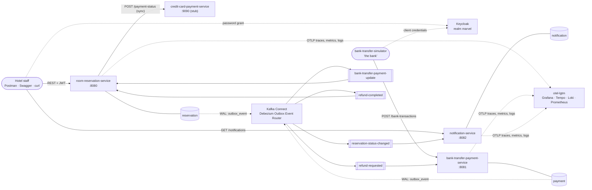
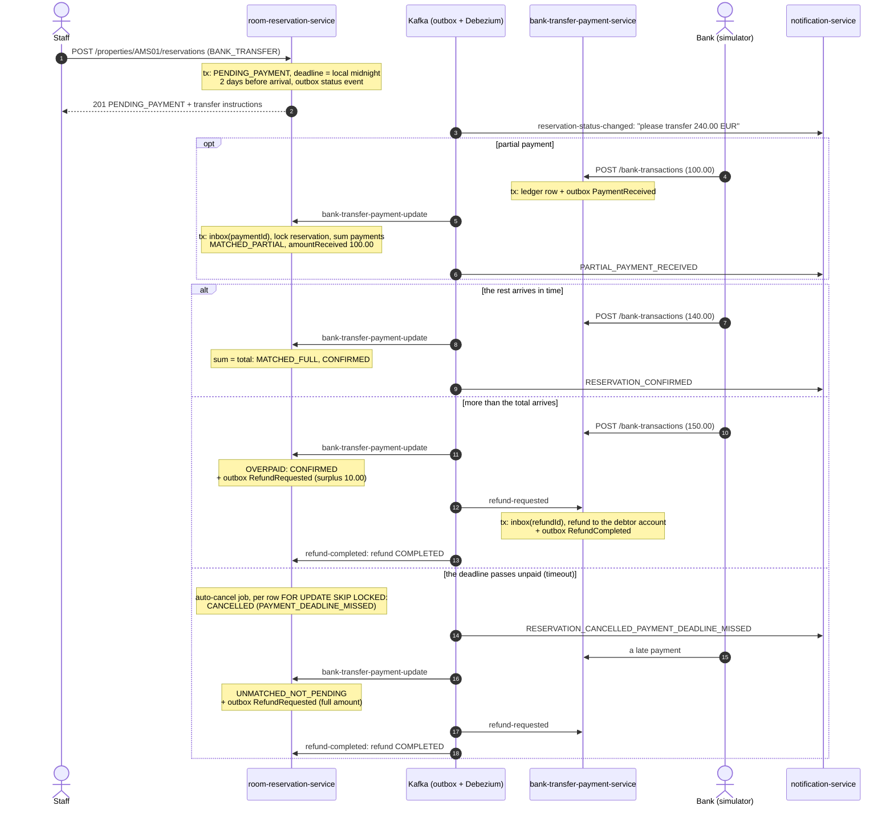

# marvel-hospitality

Take-home for CGI Netherlands: `room-reservation-service` and the event-driven system around it.

The brief asks for one service: book a room for a customer, confirm it at once for cash, confirm a credit-card
booking by asking `credit-card-payment-service`, and confirm a bank-transfer booking when the payment arrives on the
`bank-transfer-payment-update` topic, cancelling it automatically if the money is not there two days before arrival.
That service is here, together with the pieces that make the flow real and runnable end to end: a
`bank-transfer-payment-service` that adapts "the bank" to the topic and pays refunds, a stub of the credit-card
service built from the corrected spec, a `notification-service` that tells the customer about every status change,
and one `docker compose` file that starts it all with Postgres, Kafka, Debezium, Keycloak and Grafana.

The interesting part is the bank-transfer booking: it spans three services and days of wall-clock time, so there is
no distributed transaction. It is a saga of local transactions (ADR-0006): each service changes its own database and
writes an event to an outbox table in the same transaction; Debezium publishes the outbox to Kafka (ADR-0007); every
consumer is idempotent through an inbox table; money that must go back (overpayment, payment after cancellation) is
compensated with a refund; and the deadline is the saga's timeout. Double bookings are impossible because Postgres
refuses them (an exclusion constraint, ADR-0005), not because the code remembered to check. The decisions and their
alternatives are written down in [16 ADRs](docs/adr/); [TRACEABILITY.md](docs/adr/TRACEABILITY.md) maps each one to
the code and tests that implement it.

**Contents:** [Architecture](#architecture) · [The bank-transfer saga](#the-bank-transfer-saga) ·
[Run it](#run-it) · [5-minute demo](#5-minute-demo) · [More demos](#more-demos) ·
[Judgement calls](#assumptions-and-judgement-calls) · [Credit-card spec defects](#credit-card-spec-defects) ·
[Bonus](#what-is-bonus) · [Next steps](#next-steps) · [Runbook](#runbook) · [Auto-cancel](#auto-cancel) ·
[Notifications](#notifications) · [Observability](#observability) · [Repository layout](#repository-layout) ·
[Further reading](#further-reading)

## Architecture



- **Four independently deployable Spring Boot 4 / Java 25 services**, each a standalone Gradle build with its own
  database (one Postgres instance, three databases). Mechanism that is identical everywhere (JWT security,
  ProblemDetail errors, outbox, inbox, Kafka error handling, observability) lives once in [`platform/`](platform/)
  as Spring Boot starters the services build from source (ADR-0001). Business rules never go there.
- **No service publishes to Kafka itself.** Services write `outbox_event` rows; Debezium turns them into Kafka
  messages keyed by aggregate id, with `traceparent` and `propertyId` headers. The brief's topic
  `bank-transfer-payment-update` is produced the same way by the payment service.
- **Every service validates the JWT itself** (Keycloak, realm roles, a `properties` claim checked against the
  `propertyId` in the path, ADR-0002 and ADR-0012). There is no gateway in front.
- **One trace per saga**: the stored `traceparent` crosses Debezium, so a payment is one trace from the bank's
  request to the notification (ADR-0013).

## The bank-transfer saga

Every arrow into or out of Kafka is an outbox row written in the same local transaction as the change, and every
consumer records the message in its inbox table in the transaction that applies it.



Matching is by the 8-character reservation id in the transfer description (`"<10-char E2E id> <reservationId>"`),
summed over all payments, so partial payments add up in any order (ADR-0009). Card bookings are synchronous, as the
brief says: the reservation service asks the card service for the payment status and answers `201 CONFIRMED` or an
error, with timeouts, retries and a circuit breaker, and never holds a database transaction open during the call
(ADR-0011).

## Run it

Needs **Docker** (with Compose v2), **make**, **curl** and **jq**. No JDK: the services are compiled inside Docker.
Free host ports 3000, 5432, 8080–8083, 8088, 8090, 8180, 9090, 9094, 4317–4318.

```
git clone https://github.com/titas-biswas-code/marvel-hospitality.git && cd marvel-hospitality
make up-apps     # creates infra/.env from .env.example, builds the four services, starts everything and
                 # registers the Debezium connectors (the first run takes a few minutes)
```

| What | Where |
|---|---|
| Swagger UI, all services in one (pick one top left, *Authorize* with `make token`) | http://localhost:8088 |
| Swagger UI per service | [:8080](http://localhost:8080/swagger-ui.html) reservation · [:8081](http://localhost:8081/swagger-ui.html) payment · [:8082](http://localhost:8082/swagger-ui.html) notification · [:9090](http://localhost:9090/swagger-ui.html) credit card |
| Grafana: dashboards, traces, logs, metrics (no login needed) | http://localhost:3000 → *Dashboards* → *Marvel Hospitality* |
| Kafka UI: topics, messages, DLTs, connectors | http://localhost:8090 |
| Keycloak admin console (`admin` / `admin`) | http://localhost:8180/admin |
| Kafka Connect REST | http://localhost:8083/connectors?expand=status |
| Postgres (`psql` via `docker compose exec postgres`) · Kafka for host tools | 5432 · 9094 |

Users (password `password`): `alice` (`AMS01`, `RTM01`), `bob` (`AMS01`), `carol` (`RTM01`, read-only).
`make token` prints a token for alice, `make token USER=bob` for bob. Details in
[infra/keycloak/README.md](infra/keycloak/README.md); ports, containers and resets in [infra/README.md](infra/README.md).

```
make down        # stop everything, keep the data
make clean       # remove containers, volumes (all data) and the built images; the next `make up-apps` starts from scratch
make reset-apps  # wipe all data and start everything again, rebuilt
make build-all   # ./gradlew build in platform/ and every service: needs a JDK 17+ to run Gradle (it fetches JDK 25
                 # itself if missing) and Docker for Testcontainers; no running stack
```

## 5-minute demo

The whole saga from the shell, as receptionist alice at property `AMS01`. Paste the blocks in order (bash or zsh).
The same steps, with assertions and random dates so it can run any number of times, are
[`infra/e2e/smoke.sh`](infra/e2e/smoke.sh): `infra/e2e/smoke.sh` after `make up-apps`.

**1. Log in and book a cash stay: confirmed at once.**
```
TOKEN=$(make -s token)
AUTH="Authorization: Bearer $TOKEN"
R=http://localhost:8080/properties/AMS01/reservations
curl -s -X POST $R -H "$AUTH" -H 'Content-Type: application/json' -d '{"customerName":"Grace Hopper",
  "roomNumber":"101","startDate":"2031-06-01","endDate":"2031-06-03","roomSegment":"SMALL","paymentMode":"CASH"}' \
  | jq '{reservationId, status, totalAmount}'
```
→ `"status": "CONFIRMED"`, `"totalAmount": 160.00` (2 nights of a SMALL room at 80.00).

**2. Book a bank-transfer stay: it waits for the money.**
```
ID=$(curl -s -X POST $R -H "$AUTH" -H 'Content-Type: application/json' -d '{"customerName":"Ada Lovelace",
  "roomNumber":"202","startDate":"2031-05-10","endDate":"2031-05-12","roomSegment":"MEDIUM","paymentMode":"BANK_TRANSFER"}' \
  | jq -r .reservationId); echo $ID
curl -s $R/$ID -H "$AUTH" | jq '{status, totalAmount, amountReceived, paymentDeadlineAt, bankTransferInstructions}'
```
→ `PENDING_PAYMENT`, 240.00 due, a deadline of 2031-05-07T22:00:00Z (midnight in Amsterdam two days before arrival)
and the transfer instructions with the reservation id.

**3. The bank reports a partial payment of 100.00.**
```
bank-transfer-simulator/scripts/post-bank-transaction.sh --reservation $ID --amount 100 > /dev/null
sleep 2; curl -s $R/$ID -H "$AUTH" | jq '{status, amountReceived}'
```
→ still `PENDING_PAYMENT`, `amountReceived` 100.00. (The payment went bank → payment service → outbox → Debezium →
Kafka → reservation service; the two seconds are that pipeline.)

**4. The bank reports the rest: confirmed.**
```
bank-transfer-simulator/scripts/pay-in-full.sh --property AMS01 --reservation $ID > /dev/null
sleep 2; curl -s $R/$ID -H "$AUTH" | jq '{status, amountReceived}'
curl -s $R/$ID/payments -H "$AUTH" | jq -c '.[] | {amount, outcome}'
```
→ `CONFIRMED`, 240.00 received; payments `MATCHED_PARTIAL` 100.00 and `MATCHED_FULL` 140.00.

**5. The customer was told at every step.**
```
curl -s "http://localhost:8082/notifications?reservationId=$ID" -H "$AUTH" | jq -r '.[].template'
docker compose -f infra/docker-compose.yml logs notification-service | grep $ID | tail -1
```
→ `RESERVATION_CREATED_PENDING_PAYMENT`, `PARTIAL_PAYMENT_RECEIVED`, `RESERVATION_CONFIRMED`, and the rendered
confirmation in the service's JSON log (notifications are logged, not sent; see [Notifications](#notifications)).

**6. An overpayment: confirmed, and the surplus goes back.**
```
ID2=$(curl -s -X POST $R -H "$AUTH" -H 'Content-Type: application/json' -d '{"customerName":"Ada Lovelace",
  "roomNumber":"201","startDate":"2031-05-10","endDate":"2031-05-12","roomSegment":"MEDIUM","paymentMode":"BANK_TRANSFER"}' \
  | jq -r .reservationId)
bank-transfer-simulator/scripts/pay-in-full.sh --property AMS01 --reservation $ID2 --extra 10 > /dev/null
sleep 3; curl -s $R/$ID2/payments -H "$AUTH" | jq 'last | {amount, outcome, refund: (.refund | {amount, reason, status})}'
```
→ `OVERPAID` 250.00 with a refund of 10.00, reason `OVERPAYMENT`, status `COMPLETED`: the reservation service
requested it, the payment service paid it back to the debtor's account and reported back (the compensation step).

**7. Auto-cancel at the deadline, and a late payment refunded in full.** The deadline is a local midnight days away,
so the demo moves the stored deadline to now, which is what the passing of time would do (see
[Auto-cancel](#auto-cancel)):
```
ID3=$(curl -s -X POST $R -H "$AUTH" -H 'Content-Type: application/json' -d '{"customerName":"Ada Lovelace",
  "roomNumber":"301","startDate":"2031-05-10","endDate":"2031-05-12","roomSegment":"LARGE","paymentMode":"BANK_TRANSFER"}' \
  | jq -r .reservationId)
docker compose -f infra/docker-compose.yml --env-file infra/.env exec postgres psql -U reservation -d reservation \
  -c "UPDATE reservation SET payment_deadline_at = now() WHERE reservation_id = '$ID3'"
sleep 60; curl -s $R/$ID3 -H "$AUTH" | jq .status                # the job runs every 60 s
bank-transfer-simulator/scripts/post-bank-transaction.sh --reservation $ID3 --amount 360 > /dev/null
sleep 3; curl -s $R/$ID3/payments -H "$AUTH" | jq 'last | {outcome, refund: (.refund | {amount, reason, status})}'
```
→ `CANCELLED` (repeat the `curl` if the job has not run yet); the late 360.00 is `UNMATCHED_NOT_PENDING`, refunded in
full with reason `RESERVATION_CANCELLED`, and the reservation stays cancelled.

**8. See it.** Grafana → *Dashboards* → *Marvel – Saga explorer*, paste `$ID`: every log line of that reservation from
every service; *Trace* opens the payment's saga as one trace across the three services. Kafka UI shows the four
topics and their messages.

Running the blocks again with the same dates answers `409 ROOM_UNAVAILABLE`, which is the overbooking protection
at work: change the dates.

## More demos

Every feature has a Postman folder that runs on its own in the Collection Runner (or newman), fetches its own tokens,
creates its own data on random dates and can be re-run any number of times. Import `docs/postman/` (collection +
environment); details in [docs/postman/README.md](docs/postman/README.md).

| Feature | Postman folder | From the shell |
|---|---|---|
| Payment matching: a bank transfer paid in two parts (`PENDING_PAYMENT` → `CONFIRMED`) and its three notifications | Demo: bank transfer paid in two parts | the 5-minute demo |
| Booking rules: overbooking (409), wrong property (403), segment mismatch, bank-transfer lead time, card reference reused (409), card rejected (422) | Demo: booking rules | — |
| Unmatched payments: unknown reservation or unreadable description, kept for a person, not refunded | Demo: unmatched payments | `post-bank-transaction.sh --description 'hello bank' --amount 10` |
| Refunds: an overpayment's surplus, money for an already paid reservation, a refund the bank rejects | Demo: refunds | `pay-in-full.sh --property AMS01 --reservation <id> --extra 10` (add `--debtor FAIL00000000000001` for a rejected refund) |
| Notifications for cash and card bookings; the property filter | Demo: notifications | `curl …/notifications?reservationId=<id>` |
| Auto-cancel at the payment deadline | — (needs the stored deadline moved) | step 7 above |
| CDC durability: stop Kafka Connect, lose nothing | — | [docs/cdc-durability-demo.md](docs/cdc-durability-demo.md) |
| Dead letters: inspect and replay | — | [Runbook](#runbook) |

Credit-card payment references drive the stub: `OK…` confirmed, `REJ…` rejected, `ERR…` 500, `SLOW…` a 5 s answer
(timeout), anything else 404. The simulator scripts are in `bank-transfer-simulator/scripts/`
([README](bank-transfer-simulator/README.md)).

## Assumptions and judgement calls

The brief leaves these open; each is a decision, recorded in an ADR, not an accident.

- **Properties are first-class.** "Hotels" is plural and room numbers are only unique within a hotel, so rooms,
  rates and reservations belong to a property, and the property is in the URL:
  `/properties/{propertyId}/reservations`. The token's `properties` claim says which properties a user may act on
  (a regional manager has several); a mismatch is `403 FORBIDDEN_PROPERTY`. This is one company with several
  hotels, not multi-tenant SaaS. Reservation ids are unique across properties, because the bank's event cannot name
  one (ADR-0002).
- **Bank transfer needs lead time.** A bank-transfer booking whose deadline (local midnight two days before arrival,
  in the hotel's time zone) has already passed is rejected with `422 BANK_TRANSFER_LEAD_TIME_TOO_SHORT`: you cannot
  pay by transfer for tonight. The alternatives were to accept it as cash on arrival, or to accept it with a deadline
  that has already passed and let the job cancel it at once; both surprise the guest more than a clear error
  (ADR-0010).
- **Unmatched payments are not refunded automatically.** Money whose description names no known reservation is
  stored with its outcome and listed at `GET /unmatched-payments`; a person may still spot the typo. Money that names a
  reservation that is no longer waiting (cancelled or already paid) *is* refunded in full, and an overpayment's
  surplus is refunded (ADR-0009).
- **No fuzzy matching, no tolerance.** Matching is exact on the reservation id; amounts compare exactly at two
  decimals. A wrong fuzzy match would confirm the wrong room. Bank fees that make a payment slightly short are a real
  need, left for a configurable rule (ADR-0009).
- **Partial payments add up.** "The total amount not received" implies several payments; they are summed, so their
  order does not matter.
- **One currency.** Everything is EUR with exactly two decimals, in a small `Money` value object; anything else is
  rejected (`422 UNSUPPORTED_CURRENCY` at the bank adapter). JavaMoney is the step for multi-currency (ADR-0016).
- **Card bookings stay synchronous**, as the brief says: nothing is stored unless the card service says
  `CONFIRMED`. If the room is taken in the moment between that answer and the insert, the guest has paid and has no
  reservation; the provided spec has no refund operation, so this is logged at WARN "needs manual reconciliation".
  The asynchronous saga is the proper fix (ADR-0011).
- **Choreography, not orchestration.** The saga is short and each step has one obvious owner, so services react to
  each other's events; an orchestrator is the upgrade path if the flow grows (ADR-0006).
- **The payment service knows nothing about reservations.** It is Marvel's bank adapter and ledger: it records what
  the bank reports and pays refunds; matching is the reservation service's business (ADR-0014).
- **No gateway.** Each service validates tokens itself, so a network mistake cannot become an authorisation bypass
  (ADR-0012).
- **Notifications are rendered and logged**, not delivered: the event carries no contact details (see
  [Notifications](#notifications)).
- **Secrets** in `infra/.env.example` are local development defaults; a real deployment injects them from a secret
  manager ([infra/README.md](infra/README.md#secrets)).

## Credit-card spec defects

The provided OpenAPI spec for `credit-card-payment-service` has a malformed server URL
(`http//:localhost:9090//host/…`), `format: enum` where `enum:` was meant (so generators produce a plain `String`),
a status described as "Expiry date of the driving license", and `format: datetime` instead of `date-time`. The
corrected spec, with none of the corrections changing anything on the wire, is what the stub serves and the client
is generated from; the original is kept for diffing. Details:
[docs/credit-card-spec-defects.md](docs/credit-card-spec-defects.md).

## What is bonus

Beyond the brief, and built because a production-ready reservation flow needs them to run and be verified end to end:
the bank-transfer payment service and simulator, the notification service, the Keycloak security, Debezium CDC and
the observability stack. Marked bonus in the plan and done:

- `GET /properties/{propertyId}/unmatched-payments` and `GET /unmatched-payments`: reconciliation views.
- `make replay-dlt TOPIC=…`: replays dead letters after the cause is fixed.
- Provisioned Grafana dashboards (business, service health, Kafka and CDC, saga explorer).
- GitHub Actions CI ([`.github/workflows/ci.yml`](.github/workflows/ci.yml)): `./gradlew build` for `platform/` and
  every service (Testcontainers on the runner's Docker), the contract check, and the whole stack from compose with
  `infra/e2e/smoke.sh`.

## Next steps

What would come next in a real system, in rough order of value:

1. **A staff web UI**, including a reconciliation screen for unmatched payments and failed refunds.
2. **Alerts** in Grafana on `kafka_dlt_messages_total`, `debezium_slot_lag_bytes`, `refund_failed_total` and
   `reservation_autocancel_overdue` (the metrics and dashboards exist; nothing pages anyone yet).
3. **Failed refunds** (the bank rejected the account) handled in the system: today they are logged at ERROR, counted and
   shown with `status FAILED` on the payment, and a person follows up outside the system.
4. **Asynchronous card payments** as a saga step (`PENDING_AUTHORISATION`), which also removes the "paid card, no
   reservation" gap; then an orchestrator if the flows keep growing (ADR-0006, ADR-0011).
5. **Real bank adapters** (camt.053/054 statement import, PSD2) writing the same ledger (ADR-0014), and a
   tolerance rule for bank fees (ADR-0009).
6. **Notification delivery**: look up contact details, send through a real channel, record delivery status and retry.
7. **Row-level security** in Postgres keyed on `property_id` as defence in depth (ADR-0003).
8. **An edge gateway** (TLS, rate limits, token relay) in front of the services, which keep validating (ADR-0012);
   service-account tokens on the card-service call.
9. **Published platform starters** in an artifact repository instead of a source build, so services release
   independently again (ADR-0001); the KIP-848 consumer group protocol once rebalance pauses show up (ADR-0008);
   JavaMoney when a second currency arrives (ADR-0016).

## Runbook

**A message landed in a dead-letter topic.** A technical failure is tried 5 times over ~15 s, then the message goes to
`<topic>.DLT` and the partition moves on (ADR-0008). Business outcomes (an unmatched payment) are never dead-lettered.
1. Notice it: `kafka_dlt_messages_total{topic}` in Grafana (*Marvel – Kafka & CDC*), or the `.DLT` topics in Kafka UI.
2. Find out why: in Kafka UI open `<topic>.DLT` → the message → *Headers*: `kafka_dlt-exception-message` and
   `-stacktrace`; the service's ERROR log line carries the same `traceId`.
3. Fix the cause (deploy the fix, bring the database back), then replay. Every consumer is idempotent, so a message
   that was already applied is skipped:
   ```
   make replay-dlt TOPIC=bank-transfer-payment-update DRY_RUN=1   # shows what would be replayed
   make replay-dlt TOPIC=bank-transfer-payment-update             # replays; progress is kept, so re-running is safe
   ```
   (Needs `python3`. Details at the top of [`scripts/replay-dlt.sh`](scripts/replay-dlt.sh).)

**Events stopped flowing / Kafka Connect is down.** Nothing is lost: rows wait in the outbox tables and in the WAL
that each connector's replication slot holds back ([demo](docs/cdc-durability-demo.md)).
```
curl -s 'localhost:8083/connectors?expand=status' | jq 'map_values(.status | {connector: .connector.state, tasks: [.tasks[].state]})'
docker compose -f infra/docker-compose.yml --env-file infra/.env start connect                  # Connect container stopped
curl -X POST 'localhost:8083/connectors/reservation-outbox/restart?includeTasks=true&onlyFailed=true'   # a task FAILED
docker compose -f infra/docker-compose.yml --env-file infra/.env run --rm --no-deps connect-init # connector missing: re-register (idempotent)
```

**A replication slot is stalled or lost.** `debezium_slot_lag_bytes{slot}` only grows while its connector is not
consuming; past `max_slot_wal_keep_size` (1 GB) Postgres invalidates the slot to protect its disk. How to check the
slot, and how to drop and recreate it (the connector re-snapshots the last 7 days of outbox rows; consumers dedupe):
[infra/README.md → Runbook: replication slots](infra/README.md#runbook-replication-slots-debezium).

**A refund failed.** The reservation service logs at ERROR "…FAILED: …; the money is still owed and needs manual
follow-up", `refund_failed_total` goes up, and the payment shows `refund.status: FAILED` with a `failureReason` in
`GET …/reservations/{id}/payments`. Pay it back by hand; there is no automatic retry yet (Next steps).

**A card was paid but no reservation was created.** Search Loki for `needs manual reconciliation`: the line carries the
`paymentReference`. Refund it through the card provider by hand (ADR-0011).

**Auto-cancel is behind.** `reservation_autocancel_overdue` above zero after a run means due rows failed or were locked
elsewhere; the job's WARN/ERROR lines say which. Rows are retried on the next run.

## Auto-cancel

ADR-0010. A scheduled job cancels `BANK_TRANSFER` reservations still `PENDING_PAYMENT` once their payment
deadline — local midnight two days before the stay's start date, in the property's own timezone — has passed.
Safe with any number of running instances (each row is claimed individually with `FOR UPDATE SKIP LOCKED`) and
safe across restarts (the deadline is a persisted column, not an in-memory timer, so nothing is lost by being
down across it).

| Setting | Env var | Default |
|---|---|---|
| `reservation.auto-cancel.enabled` | `RESERVATION_AUTO_CANCEL_ENABLED` | `true` |
| `reservation.auto-cancel.interval` | `RESERVATION_AUTO_CANCEL_INTERVAL` | `PT60S` |
| `reservation.auto-cancel.initial-delay` | — | `PT30S` |
| `reservation.auto-cancel.batch-size` | — | `100` |

Metrics: `reservation.autocancel.cancelled` (counter, tagged `propertyId`) and `reservation.autocancel.overdue`
(gauge — rows still due after the last run; above zero means something is failing or held elsewhere).

The demo (step 7) edits the stored deadline instead of changing a setting. The deadline is always a local midnight, so
no "days before start" value could bring the first cancellation closer than the next midnight. Editing the row does
what the passing of time would do. To poll every 5 s instead of 60 s, set `RESERVATION_AUTO_CANCEL_INTERVAL=PT5S` in
`infra/.env` and run `make up-apps` again.

## Notifications

Every `reservation-status-changed` event becomes one stored, rendered notification, handed to a channel after its
transaction commits. The only channel logs the text at INFO (`reservationId` and `propertyId` in the MDC); nothing is
sent to a customer. The event carries no contact details (e-mail, phone) and no bank account number, so the booking
message points to the booking confirmation for the account to pay into. A real system would look the customer's contact
details and the property's account up by reservation before sending, and would add a delivery status plus a retrying
sender so a crash between storing and sending cannot lose a message.

## Observability

Every service sends traces, metrics and logs over OTLP to one container, `otel-lgtm` (ADR-0013). Grafana:
**http://localhost:3000** (no login) → *Dashboards* → folder **Marvel Hospitality**, provisioned from
[`infra/grafana/dashboards/`](infra/grafana/dashboards/) (a JSON file dropped there appears within seconds, no import):

| Dashboard | Shows |
|---|---|
| Marvel Hospitality | Business view: reservations by status, payments by outcome, refunds, DLT count, slot lag, p95 latency |
| Marvel – Service health | Per service: request rate, 4xx/5xx, p50/p95/p99, credit-card call latency, circuit breaker, retries, heap, GC, threads, CPU, connection pool, warnings/errors |
| Marvel – Kafka & CDC | Consumer lag per topic, records consumed, last poll, rebalances, listener time and results, DLT, Debezium slot lag |
| Marvel – Saga explorer | Type a reservation id: its log lines from every service (click *Trace* to open the saga in Tempo), recent traces with a Kafka hop, all warnings and errors |

The dashboards otel-lgtm ships itself (*JVM Overview*, *RED Metrics*) expect OpenTelemetry-agent metric names and
stay mostly empty for these Micrometer-instrumented services.

**Sampling.** Locally every trace is kept (`management.tracing.sampling.probability: 1.0`, `local` profile); Boot's
default elsewhere is 0.1. To keep 30 %, set `MANAGEMENT_TRACING_SAMPLING_PROBABILITY=0.3` in a service's environment
(e.g. under `environment:` in `infra/docker-compose.yml`). The decision is taken once, where a trace starts (an HTTP
request without `traceparent`, a scheduled job), and every later hop follows it — including across Debezium, since
the flag travels in the stored `traceparent` — so a saga is kept whole or not at all. Log lines of a dropped trace
still carry its `trace_id`; only Tempo has nothing to show for it.

**One saga, one trace.** A trace does not stop at Kafka: each outbox row stores the `traceparent` of the work that
wrote it, Debezium copies it into the Kafka header, and the consumer's span continues that trace. A bank payment is
therefore a single trace: the bank's `POST /bank-transactions` → the reservation service applying it → the
notification, and for an overpayment the refund in the payment service and its completion back in the reservation
service. (The booking itself is a separate trace: the request that created it.)

**Finding your way in Grafana.**
- *Explore* shows one data source at a time: pick it in the drop-down at the top left of the page (**Loki** for
  logs, **Tempo** for traces, Prometheus for metrics). There is no sub-menu per data source.
- For a search-bar-and-results view (Splunk-style), use *Explore* → **Loki** and switch the query editor from
  *Builder* to *Code*. *Drilldown* → *Logs* is Grafana's point-and-click alternative, grouped by service.
- Grafana lets anyone in without a login, but then shows an "Unauthorized" toast on every page: the page asks for
  the user's starred dashboards and teams, which an anonymous visitor does not have. Harmless; *Sign in* as
  `admin` / `admin` makes it go away.
- Telemetry is kept in the `otel-lgtm-data` volume: it survives restarts and `make down`, and `make clean` removes it.

| To find | LogQL (Explore → Loki, *Code*) |
|---|---|
| Everything | `{service_name=~".+"}` |
| One service | `{service_name="room-reservation-service"}` |
| Free text | `{service_name=~".+"} \|= "Refund"` |
| One reservation / payment / refund | `{service_name=~".+"} \| reservationId="P6FDGTP4"` (or `paymentId=`, `refundId=`) |
| Errors only | `{service_name=~".+"} \| severity_text="ERROR"` |
| One trace's log lines | `{service_name=~".+"} \| trace_id="<trace id>"` |

Click a log line to see its fields; the **Trace** button next to `trace_id` opens the trace in Tempo. The
*Marvel – Saga explorer* dashboard does the reservation search without writing a query.

**Find the saga of one reservation** after running the 5-minute demo (`$ID` from there):

1. Grafana → *Explore* → **Loki**, code mode:
   ```
   {service_name=~".+"} | reservationId="<your $ID>"
   ```
   Every log line about that reservation, from every service. Log lines also carry `propertyId`, and `paymentId` /
   `refundId` where known, as fields to filter on.
2. Expand a line of the payment ("Payment … OVERPAID" / "CONFIRMED") and click **Trace: …** next to `trace_id`: Tempo
   opens the whole saga as one waterfall across `bank-transfer-payment-service`, `room-reservation-service` and
   `notification-service`.
3. From any span, **Logs for this span** jumps back to Loki for that trace.

The same ids are in the console JSON (`docker compose -f infra/docker-compose.yml logs room-reservation-service`):
`traceId`, `spanId`, `reservationId`, `propertyId`, … on every line.

**Metrics** (Grafana → *Explore* → **Prometheus**; dots become underscores, counters get `_total`):
`reservation_created_total{paymentMode,status,propertyId}`, `payment_matched_total{outcome}`,
`refund_requested_total{reason}`, `refund_failed_total`, `reservation_autocancel_cancelled_total`,
`kafka_dlt_messages_total{topic}` and `debezium_slot_lag_bytes{slot}` (WAL each Debezium slot holds back, read every 30 s
by the reservation and payment services), plus Boot's HTTP, JVM and Kafka meters. Every meter is tagged `service`.

**Health.** `/actuator/health/readiness` is UP only when the service's database and Kafka answer (the compose
healthchecks use it); liveness does not depend on either.

## Repository layout

| Folder | What |
|---|---|
| [`room-reservation-service/`](room-reservation-service/) | The brief's service: reservations, payment matching, auto-cancel, refund requests. DB `reservation` |
| [`bank-transfer-payment-service/`](bank-transfer-payment-service/) | Bank adapter and payment ledger: ingests bank transactions, publishes `bank-transfer-payment-update`, pays refunds. DB `payment` |
| [`credit-card-payment-service/`](credit-card-payment-service/) | Stub of the corrected credit-card spec (in memory) |
| [`notification-service/`](notification-service/) | Renders and logs a notification per status change. DB `notification` |
| [`platform/`](platform/) | Spring Boot starters for the shared mechanism: security, problem details, outbox, inbox, Kafka, observability |
| [`bank-transfer-simulator/`](bank-transfer-simulator/) | "The bank": scripts that post bank transactions |
| [`infra/`](infra/) | `docker-compose.yml`, Keycloak realm, Debezium connectors, topics, Grafana, `e2e/smoke.sh` |
| [`docs/`](docs/) | ADRs, contracts, Postman collection, resolved versions |

Each service has a README with how to run and test it, its API, its messages and its configuration.

## Further reading

| Topic | Where |
|---|---|
| Design decisions (ADR index) | [docs/adr/](docs/adr/) |
| Which code implements which ADR | [docs/adr/TRACEABILITY.md](docs/adr/TRACEABILITY.md) |
| API, event and database contracts | [docs/contracts/](docs/contracts/) |
| Defects in the provided credit-card spec, and the corrections | [docs/credit-card-spec-defects.md](docs/credit-card-spec-defects.md) |
| CDC durability demo (stop Kafka Connect, lose nothing) | [docs/cdc-durability-demo.md](docs/cdc-durability-demo.md) |
| Local infrastructure, ports, connectors, runbook | [infra/README.md](infra/README.md) |
| Keycloak realm, users, tokens | [infra/keycloak/README.md](infra/keycloak/README.md) |
| Bank simulator scripts | [bank-transfer-simulator/README.md](bank-transfer-simulator/README.md) |
| Postman collection | [docs/postman/README.md](docs/postman/README.md) |
| Resolved library and image versions | [docs/versions.md](docs/versions.md) |
